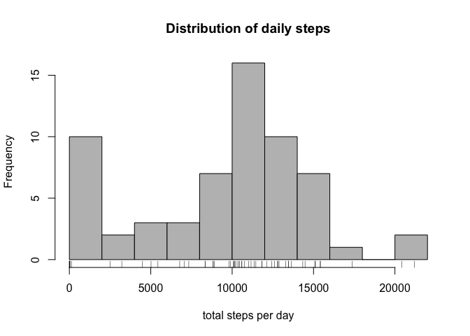
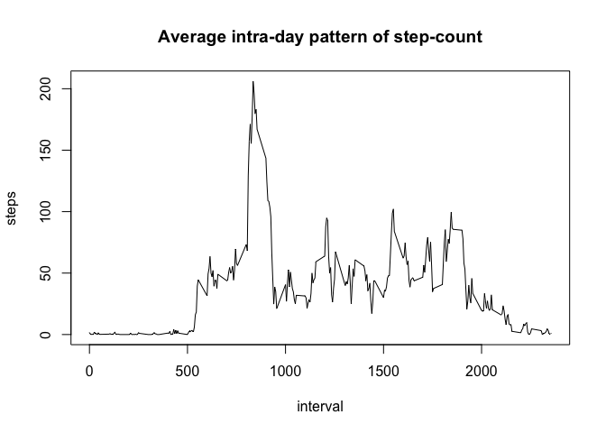
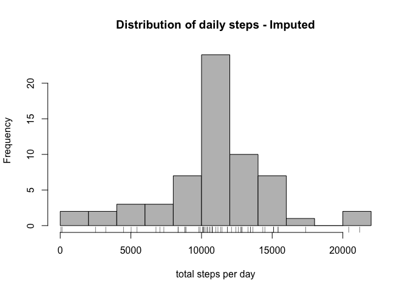
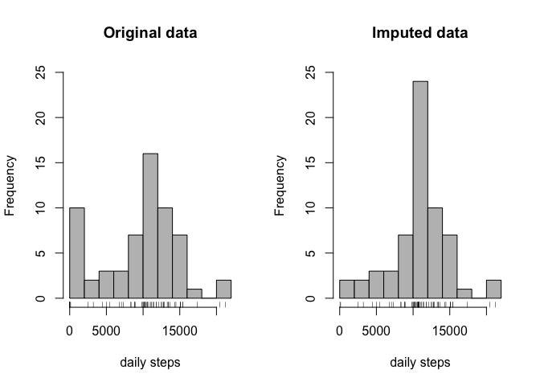
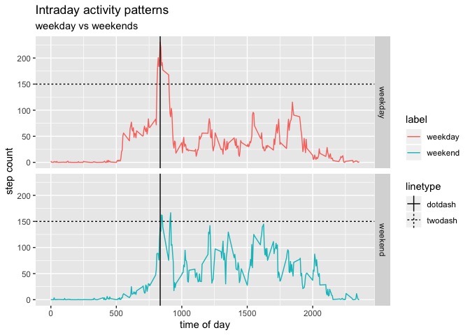

## Introduction

It is now possible to collect a large amount of data about personal movement using activity monitoring devices such as a Fitbit, Nike Fuelband, or Jawbone Up. In this report, we will analyse sample data from such a device, look at average daily on in-day pattern.   
The data consists of two months of data from an anonymous individual collected during the months of October and November, 2012 and include the number of steps taken in 5 minute intervals each day.


## Loading and preprocessing the data

Let us first load the data into R and have a look at its characteristics. 


```r
library(tidyverse)
library(lubridate)
```


```r
unzip("activity.zip")
dataset <- as_tibble(read.csv("activity.csv"))
str(dataset)
```

```
## Classes 'tbl_df', 'tbl' and 'data.frame':	17568 obs. of  3 variables:
##  $ steps   : int  NA NA NA NA NA NA NA NA NA NA ...
##  $ date    : Factor w/ 61 levels "2012-10-01","2012-10-02",..: 1 1 1 1 1 1 1 1 1 1 ...
##  $ interval: int  0 5 10 15 20 25 30 35 40 45 ...
```

We notice **3 variables**, and **17568 observations**, with quite a few NAs already in the first few lines.  


## What is mean total number of steps taken per day?  

We can now summarize the data by day, taking the sum of the steps on each day. Note that we need to remove NAs as we do so.  
    

```r
per_day <- dataset %>% group_by(date) %>%
        summarise(total_steps = sum(steps, na.rm = TRUE))

daily_avg <- mean(per_day$total_steps, na.rm = TRUE)
daily_median <- median(per_day$total_steps, na.rm = TRUE)
```

    
We find that on **average** the subject has taken **9354 steps per day**, rounding to the nearest unit.  
The **median** of the total number of steps is **10395**. Hence, we can already observe some skew in the distribution of steps.  
We can confirm this visually by looking at the histogram of the daily total number of steps.


```r
hist(per_day$total_steps,breaks=10, col = "grey",
     main = "Distribution of daily steps", xlab = "total steps per day")
rug(per_day$total_steps)
```

<!-- -->

We can see a **large number of days (10 at least) have a step count below 2000**. It would be interesting to see if we can find a reason for this pattern. 


## What is the average daily activity pattern?

One other distribution we can look at, is the **intra-day distribution**. We group the data again, this time by interval variable. 


```r
per_interval <- dataset %>% group_by(interval) %>%
        summarise(avg_steps = mean(steps, na.rm=TRUE))
```

By doing this we can now visualize the average daily pattern of our subject's step count. 


```r
with(per_interval,plot(interval, avg_steps, type = "l",ylab= "steps"))
title(main = "Average intra-day pattern of step-count")
```

<!-- -->

The line is flat before 5 am, which is probably due to sleep. There is a spike of activity between 8 and 10am. We can find out what exact 5-minute interval has on average the  highest number of steps. 


```r
peak_int <- per_interval[which.max(per_interval$avg_steps),]$interval
peak_count <- round(max(per_interval$avg_steps))
print(peak_int)
```

```
## [1] 835
```

```r
print(peak_count)
```

```
## [1] 206
```

We find that, on average, **the peak 5-minute interval** occurs at around **8:35 am**, with a step count of **206** steps.


## Imputing missing values
As mentioned earlier, we noticed quite a few missing values just looking at the first few lines of the dataset. Let"s find out how many values we are actually missing. 


```r
(na_count <- sum(is.na(dataset$steps)))
```

```
## [1] 2304
```

```r
nrow(dataset) - sum(complete.cases(dataset)) 
```

```
## [1] 2304
```
We have 2304 missing values in the steps variable, which also correspond to the number of lines with missing values. Thus, we can conclude that all missing values are occur in the steps column. 

We can try to fill in these missing values: one way to do so is to fill in each missing step count with the average step count of the same 5-minute window, using the intra-day pattern we just plotted earlier.   
We must first join the original table with the per_interval table, matching their interval variables. We then apply a condition, to only impute the average intraday step only when the data is missing. 


```r
new_dataset <- left_join(dataset, 
                            select(per_interval, interval, avg_steps),
                            "interval")

new_dataset <- new_dataset %>%
        mutate(steps = ifelse(is.na(steps),avg_steps, steps)) %>%
        select( -avg_steps)
```

We now have a new data table, with identical size and structure compared to the original, but with no missing values. 


```r
(new_na_count <- sum(is.na(new_dataset$steps)))
```

```
## [1] 0
```

```r
nrow(dataset) - sum(complete.cases(new_dataset)) 
```

```
## [1] 0
```

Let us see what effect this operation has on daily distribution of average total steps. 


```r
new_per_day <- new_dataset %>% group_by(date) %>%
        summarise(total_steps = sum(steps, na.rm=TRUE))

new_daily_avg <- mean(new_per_day$total_steps, na.rm = TRUE)
new_daily_median <- median(new_per_day$total_steps, na.rm = TRUE)
```

The **mean** total daily step count is now **10766.19** (compared to 9354 earlier). 
As for the **median** total daily step count, it is now **10766** (compared to 10395 earlier).   
Both estimates have changed, quite significantly for the mean. Interestingly, **mean and median have converged**, which would suggest that the skew we observed earlier may no longer be as strong.  

Let us see if this hypothesis can pass the eye test. 

```r
hist(new_per_day$total_steps,breaks=10, col = "grey",
     main = "Distribution of daily steps - Imputed", xlab = "total steps per day")
rug(new_per_day$total_steps)
```

<!-- -->

The first thing we notice that the **number of days with a very low step count has diminished**.   

When we can compare it the original histogram, side-by-side, we also observe that the histogram has gotten "taller" at the center. This suggests a **re-distribution of the low count days towards the mean**, which is **consistent with our imputing method** of replacing missing values with the average step count of the corresponding time slot. 


```r
par(mfrow=c(1,2))
hist(per_day$total_steps, breaks=10, col = "grey",
     main = "Original data", xlab =  "daily steps", ylim = c(0,25))
rug(per_day$total_steps)

hist(new_per_day$total_steps, breaks=10, col = "grey",
     main = "Imputed data", xlab = "daily steps", ylim = c(0,25))
rug(new_per_day$total_steps)
```

<!-- -->


```r
summary(per_day$total_steps)
```

```
##    Min. 1st Qu.  Median    Mean 3rd Qu.    Max. 
##       0    6778   10395    9354   12811   21194
```

```r
summary(new_per_day$total_steps)
```

```
##    Min. 1st Qu.  Median    Mean 3rd Qu.    Max. 
##      41    9819   10766   10766   12811   21194
```

By comparing the summary outputs, we can confirm our hypothesis. The original data had days with zero total step count, suggesting that summarizing operation was *effectively* replacing missing values with zeros. This was bringing down the average significantly.

That effect was removed by the imputing method. We no longer have zero count days, **the 25% quantile, has increased  along with the mean and median**; but the 75% quantile remained unchanged. This confirms a **redistribution from the left tail towards the center only**, not the right tail. 


## Are there differences in activity patterns between weekdays and weekends?  

One last analysis, we could do is to compare the pattern of activity of our subject across the days of the week. Specifically, we can compare the activity during the weekends vs weekdays.   

In order to achieve this, we create a new indicator variable in our new dataset, to differentiate weekend observations from weekday ones.


```r
new_dataset <- new_dataset %>%
        mutate(wkday = weekdays(ymd(date))) %>%
        mutate(label = ifelse(
                wkday %in% c("Saturday", "Sunday"),"weekend","weekday"))

new_per_interval <- new_dataset %>% group_by(interval,label) %>%
        summarise(avg_steps = mean(steps, na.rm=TRUE))
```

We can now plot and compare the 2 patterns. 


```r
g <- ggplot(new_per_interval, aes(interval, avg_steps, color = label))
g <- g + geom_line() + facet_grid(label ~. , scales = "fixed")
g <- g + labs(title = "Intraday activity patterns" )
g <- g + labs(subtitle = "weekday vs weekends" )
g <- g + labs(x = "time of day", y = "step count" )
g <- g + geom_hline(aes(yintercept = 150, linetype = "twodash") )
g <- g + geom_vline(aes(xintercept = peak_int, linetype = "dotdash") )
print(g)
```

<!-- -->

There are a few observations we can make:  

1. the line stays flat longer before rising, so our **subject is probably waking up later during the weekend**
1. the **peak is much less pronounced around 8:35 am**, which may suggest the peak observed in the aggregate data originated more from the weekday morning activity (going to work/school?)  
1. there is higher between 10 am and 6pm during weekend, which suggests our **subject is more active during the daytime at weekends, or less active during weekday daytime** (work/school less active, office job?)  
1. finally the line flattens later at the right, which may suggest our subject **tends to stay awake a little longer at night during weekends**.   


